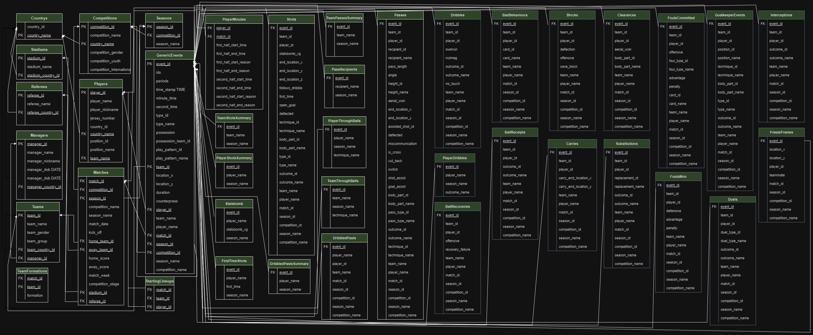

# Comp_3005_Final_Project_V1

### Name & Student Number:

- Name: Abdulrahman Awad
- Student Number: 101256090

___
***NOTE**: The autograder can be ran without step 1 and 2 as we have dbexports.sql which is the db dump file that can be used to create the database and the tables. The json data has already been parsed and loaded into the database tables so the autograder can be ran directly.*
___
### STEP 1. Create the database:

1.  Create a database called "project_database" in PostgreSQL.


___
### STEP 2: Parse JSON DATA (only necessary once) 
#### *Submission already has parsed json data and created the csv files  so this step is not necessary

- To parse the json data and place the data into csv files where the records in 
each csv file will be copied directly into a table in the database, run the following command:

1. Navigate to the json_loader folder
```bash
cd json_loader
```

2. Run the following command to parse the json data and place the data into csv files:
```bash
python parse_data.py
```


___

### STEP 3. Create the tables and load the data into the database:

run the following command to load the data into the database tables

```bash
python populate_db.py
```
____
### STEP 3. Run the autograder:

- Will use the dbexports.sql file to create the database and the tables, and will query the database to answer the 10 queries including the bonus in the autograder.

```bash
python queries.py
```

___

### FILE STRUCTURE AND DESCRIPTIONS:

- **Folder**: json_loader: Contains the json files and the python script to load the data into the database tables.
    - **Folder**: **competitions_data**: Contains the json files for the competitions.
    - **Folder**: **events_data**: Contains the json files for the events for each match.
    - **Folder**: **lineups_data**: Contains the json files for the lineups for each match.
    - **Folder**: **matches_data**: Contains the json files for the matches.

    - **File**: **download_jsons.py**: Personal Python script to download the json files from github and place them in events_data and lineups_data folders.
    - **File**: **parse_data.py**: Python script to parse the json data and place the data into csv files.
    - **File**: **defs.py**: Python script containing the definitions for the json_loader scripts.
    - **File**: **populate_db.py**: Python script to create the tables and load the data into the database tables.
    - **File**: **utils.py**: Python script containing the utility functions for the json_loader scripts.
    - **File**: **DDL.sql**: SQL script to create the tables for the database.

- **Folder**: readme_images: Contains the images used in the README file.
- **File**: DB_Schema.png: Image of the database schema.
- **File**: ER_MODEL.png: Image of the ER Model.
- **File**: **push.sh**: Bash script to push the files to git.
- **File**: **README.md**: This file.
- **File**: **queries.py**: Python script to run the autograder for Abdulrahman Awad.
- **File**: **dbexports.sql**: SQL script to create the database dump.

____

### BONUS QUERIES:
____

[Open_Data_Events_v4.0.0.pdf](../../../../../Downloads/Open_Data_Events_v4.0.0.pdf)

____
#### **Bonus Query 1**: Divide the goal into 6 equal-size areas (top-left, top-middle, top-right, bottom-left, bottom-middle, and bottom-right). In the La Liga seasons of 2020/2021, 2019/2020, and 2018/2019 combined, find the players who shot the most in either the top-left or top-right corners. Sort them from highest to lowest.


##### CORNERS DIMENSIONS:


AWAY GOAL DIMENSIONS:
COORDINATES ARE THE SAME, except x is 0 instead of 120

Now that we know the coordinates of the top right and left corners, we can find the players who shot the most in either of these corners. by constrructing the query where the x,y,z location of the shot is within the range of the top right or left corners.

#### SQL Query for Bonus Query 1:
```sql  
SELECT player_name, COUNT(*) as num_shots_top_corners
    FROM Shots
    WHERE season_name IN ('2018/2019', '2019/2020', '2020/2021')
        AND competition_name = 'La Liga'
        AND ((end_location_x = 120 AND end_location_y BETWEEN 36 AND 38.67 AND end_location_z BETWEEN 1.33 AND 2.67)
        OR (end_location_x = 120 AND end_location_y BETWEEN 41.33 AND 44 AND end_location_z BETWEEN 1.33 AND 2.67)
        OR (end_location_x = 0 AND end_location_y BETWEEN 36 AND 38.67 AND end_location_z BETWEEN 1.33 AND 2.67)
        OR (end_location_x = 0 AND end_location_y BETWEEN 41.33 AND 44 AND end_location_z BETWEEN 1.33 AND 2.67))
    GROUP BY player_name
    HAVING COUNT(*) > 0
    ORDER BY num_shots_top_corners DESC
```
____ 

#### Bonus Query 2: In the La Liga season of 2020/2021, find the teams with the most successful passes into the box. Sort them from the highest to lowest


##### BOX COORDINATES:

BOX 1:
- x: 0 y: 62
- x: 0 y: 18
- x: 18 y: 18
- x: 18 y: 62

BOX 2:
- x: 102 y: 18
- x: 120 y: 18
- x: 120 y: 62
- x: 102 y: 62

Now that we have the x,y coordinates of the corners of the box, any pass that is succcesful and has a end_location within the box will be counted as a successful pass into the box. We can construct the query to find the teams with the most successful passes into the box by counting the number of successful passes that have an end_location within the box.

#### SQL Query for Bonus Query 2:
```sql
SELECT team_name, COUNT(*) as num_passes_into_box
    FROM Passes
    WHERE competition_name = 'La Liga'
        AND season_name = '2020/2021'
        AND (end_location_x >= 0 AND end_location_x <= 18 AND end_location_y >= 18 AND end_location_y <= 62
        OR end_location_x >= 102 AND end_location_x <= 120 AND end_location_y >= 18 AND end_location_y <= 62)
        AND outcome_name is NULL
    GROUP BY team_name
    HAVING COUNT(*) > 0
    ORDER BY num_passes_into_box DESC;
```

____

#### BONUS QUERIES VIDEO DEMONSTRATION:

LINK: https://youtu.be/lc0Kb12VGIc

____


### ER MODEL:


____

### Database Schema:

